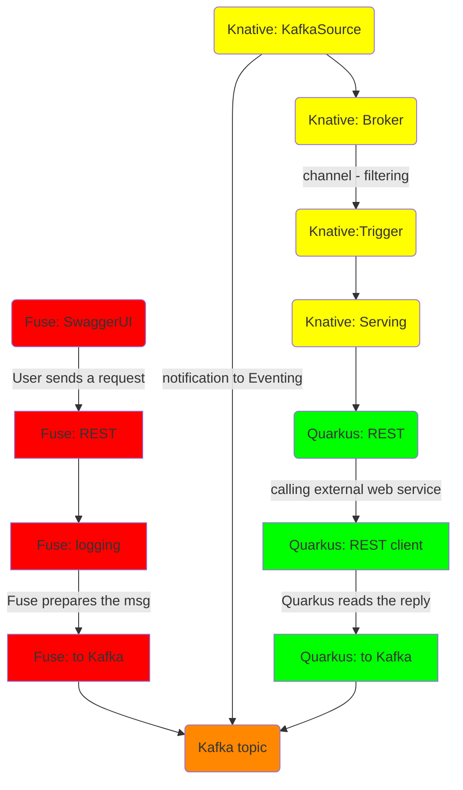

# Overview
In this tutorial we will show how to build two simple examples of serverless enabled microservice architecture.  

In the first one we will explore how events coming from Kafka can trigger the execution of a serveless component that, based on the payload of the event, will query an external service.

In the second example we will see how variations in a NoSQL database can trigger events and get visualized.  

## Prerequisites
* having a running OpenShift cluster or CodeReady Containers (v4.6+)
* have cluster admin rights on the cluster to install some of the components
* having installed Serverless operators on the cluster [like this](https://docs.openshift.com/container-platform/4.9/serverless/install/install-serverless-operator.html)
* having prepared the cluster for Fuse [deployment](https://access.redhat.com/documentation/en-us/red_hat_fuse/7.10/html/fuse_on_openshift_guide/get-started-admin)
* having a working version of Apache Maven [v3.8.1 minimum](https://access.redhat.com/documentation/en-us/red_hat_build_of_quarkus/2.2/guide/e75e6f99-0d92-4236-bfb8-2de30a6a605d)
* updating the maven settings to point to Red Hat repository [like this](https://access.redhat.com/documentation/en-us/red_hat_build_of_quarkus/2.2/guide/e75e6f99-0d92-4236-bfb8-2de30a6a605d#_edb1ae30-5684-4d33-965e-793f06026280)
____________

# Components setup
## AMQ Streams installation
You first need to install AMQ Streams operator [like this]()  
AMQ Streams as an Operator will give you access to the whole Kafka ecosystem managed in a kubernetes way

You can then create a Kafka cluster by providing a CR Kafka definition to the AMQ Streams Operator (you can find an example of definition [here](config-resources/kafka-cluster.yml))  
As you might have noticed, I've added a configMap to the definition, which you can find [here](config-resources/kafka-metrics.yml) to enable advanced monitoring of your Kafka cluster using Prometheus

### monitoring AMQ Streams

## Serverless installation
You would need as a starter to install Knative operator [like this](https://docs.openshift.com/container-platform/4.9/serverless/install/install-serverless-operator.html).  
As you can read in the documentation, Serverless platform feature includes 3 main components:
1. Knative Serving
2. Knative Eventing
3. Knative Kafka [here](https://docs.openshift.com/container-platform/4.9/serverless/admin_guide/serverless-kafka-admin.html)

You would need to instatiate all 3 of them for this demo.

create event source kafkasource in case of connecting directly kafkasource with serving endpoint
otherwise connect kafkasource to default knative broker and then create trigger with filtering

### monitoring Knative components
You can monitor the health of Serverless components by using the embdedded Monitoring stack inside OpenShift.  
For more information you can check the [docs](https://docs.openshift.com/container-platform/4.9/serverless/admin_guide/serverless-admin-monitoring.html)

_____________
# First example

The first example is composed of a Fuse and a Quarkus microservice.
The following is the dependency workflow

### description

### deployment on OpenShift
using jkube plugin to deploy:  
`mvn  install -Popenshift`

### usage

## [Quarkus project](https://github.com/lucamaf/psychic-happiness/tree/main/rest-knative-weather)

### description

### deployment on OpenShift
using the serverless option in application.properties  
`quarkus.kubernetes.deployment-target=knative`

to deploy use:  
`mvn clean package -Dquarkus.kubernetes.deploy=true`

### usage

# Second example

## flow

## MongoDB events
installed mongodb bitnami
https://dev.to/tylerauerbeck/deploying-bitnami-s-postgres-helm-chart-on-openshift-1mcl
https://github.com/bitnami/charts/tree/master/bitnami/mongodb
with values from [here](config-resources/values.yaml)
*the modification I introduced are related to securitycontext and are needed to deploy correctly on top of OpenShift*

kamelet source mongodb
https://camel.apache.org/camel-kamelets/0.7.x/mongodb-source.html
tracking id option working only with capped collection (https://www.mongodb.com/docs/manual/reference/glossary/#std-term-capped-collection)

### usage
leverage mongo-ui

## Knative serving
serving with event display

### usage
check the pod logs